# Azure Machine Learning

[*Official Documentation HERE*](https://azure.microsoft.com/ko-kr/services/machine-learning/)

## Azure AI Ecosystem

### 기본구성
 

#### [Azure AI 서비스 구조]
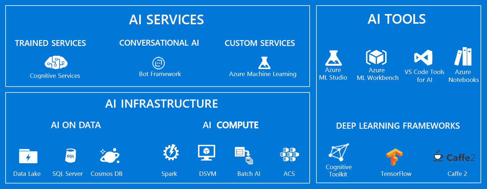
 

#### [Azure ML & 기타 서비스 활용 예시]
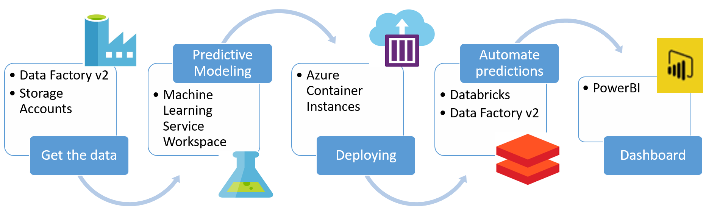
 

---
## __Azure Maching Learning__:
ML 모델의 학습, 배포, 자동화, 관리 및 추적에 사용할 수 있는 클라우드 기반 환경
 

#### [주요 구성요소]

| 구분 | 설명 |
| :-- | :-- |
| **Workspace(작업 영역)** | 최상위 Resource, Azure ML 작업의 기본 Layer |
| **Experiments(실험)** | Script의 실행을 그룹화한 형태 |
| **Environments(환경)** | ML Scripts를 위한 환경변수, 패키지, S/W 설정 지정 |
| **Data(데이터)** | ML Data 관리 통합 솔루션(Azure Storage -> ML Dataset)  |
| **Model Training** | SDK,CLI,GUI로 학습 작업 컨트롤 | 
| **ML Pipelines** | ML 작업을 위한 독립적 실행모듈로 구성된 Workflow |
| **ML Endpoint** | Azure ML Web 서비스 포털에서 배포하는 모델 Inference API |
| **Model Management(MLOps)** | Pipelining, 등록, 패키징, 배포, 모니터링, 업데이트 관리 |
| **Interpretability(해석력)** | `Python Explainers`를 활용하여 SHAP 방식 해석력 제공 |
| **Automated ML** | End-to-End 자동화 ML 서비스 |
| **Compute Instance** | `Jupyter(Python, R)`, `RStudio` 기반 노트북 환경 제공 |
| **Compute Target** | Script 실행, 서비스 Hosting 리소스/환경: 분산처리, IoT 지원 |
| **ONNX(Open Neural Network Exchange)** | Inference Optimization |

 

#### Tools
* Web
  - **Azure ML Studio**
  - **Azure ML Designer(Enterprise Edition Only)**: Drag & Drop<>, *(Enterprise Edition에서만 사용 가능)*
* SDK
  - **Python SDK**
  - **R SDK**
* CLI
  - **Azure ML CLI**
* IDE
  - **Jupyter Notebook**
  - **VSCode Extension**
 

#### Azure ML: 다른 서비스와 통합
Azure Machine Learning은 Azure 플랫폼의 다른 서비스와 함께 작동하며, Git 및 MLflow 같은 오픈 소스 도구와 통합 가능
* **Azure Kubernetes Service, Azure Container Instances, Azure Databricks, * Azure Data Lake Analytics, Azure HDInsight** 등의 컴퓨팅 대상: [컴퓨팅 대상이란?](https://docs.microsoft.com/ko-kr/azure/machine-learning/concept-compute-target)
* **Azure Event Grid**: [Azure Machine Learning 이벤트 사용](https://docs.microsoft.com/ko-kr/azure/machine-learning/concept-event-grid-integration)
* **Azure Monitor**: [Azure Machine Learning 모니터링](https://docs.microsoft.com/ko-kr/azure/machine-learning/monitor-azure-machine-learning)
* **Azure Storage** 계정, **Azure Data Lake Storage, Azure SQL Database, Azure Database for PostgreSQL, Azure Open Datasets** 등의 데이터 저장소: [Azure 스토리지 서비스에서 데이터 액세스](https://docs.microsoft.com/ko-kr/azure/machine-learning/how-to-access-data) 및 [Azure Open Datasets](https://docs.microsoft.com/ko-kr/azure/machine-learning/how-to-create-register-datasets#create-datasets-with-azure-open-datasets)로 데이터 세트 만들기
* **Azure Virtual Network**: [가상 네트워크에서 실험 및 유추 보호](https://docs.microsoft.com/ko-kr/azure/machine-learning/how-to-enable-virtual-network)
* **Azure Pipelines**: [기계 학습 모델의 학습 및 배포](https://docs.microsoft.com/ko-kr/azure/devops/pipelines/targets/azure-machine-learning)
* **Git** Repository Log: [Git 통합](https://docs.microsoft.com/ko-kr/azure/machine-learning/concept-train-model-git-integration)
* **MLflow**: [MLflow를 사용하여 메트릭을 추적하고 모델 배포](https://docs.microsoft.com/ko-kr/azure/machine-learning/how-to-use-mlflow)-실험 환경에 상관 없이 (Remote Compute Target/Instance,Local, Azure Databricks Cluster 등) 학습 실행 메트릭과 모델 아티팩트를 기록, 추적
* **Kubeflow**: [End-to-End Worflow Pipeline 빌드](https://www.kubeflow.org/docs/azure/)
 

### 기능 일람
* 환경 설정
  - 개발환경/SW 설정
  - 입출력 Directory 설정
  - Debugging, Interactive
  - Git

* 데이터 작업
  - Azure Storage 연결
  - Datastore에서 가져오기
  - Dataset으로 학습
    - Drift 탐지
    - Versioning
  - Designer에서 가져오기
  - Labeling
    - Label 지정된 데이터 가져오기
    - Label 지정(Image)
    - Label로 Dataset 만들기

* 모델 학습
  - Designer
  - ML용 Estimator
  - Scikit-learn
  - Tensorflow
  - Keras
  - PyTorch
  - Chainer

* Automated ML
  - Automated ML 서비스 사용(Python & Interface)
  - Remote Compute Target 사용
  - ML Task 정의

* 모델 해석
  - Local/Remote 모델
  - Automated ML 모델

* ML Pipelining
  - 리소스 할당량 관리
  - 데이터 Export/Delete
  - Event-based Workflow

* 실험 이력 추적/모니터링
  - 학습 Metric Logging
  - MLflow
  -Tensorboard

* 모델 배포/제공
  - Azure Kubernetes Service
  - Azure Container Instances
  - IoT Edge
  - Inference 가속: FPGA, GPU
  - Azure App Service
  - Compute Instances
  - Docker Images, User-defined
  - 기존 모델
  - Debugging

* 모델 모니터링
  - 모델데이터 수집/평가
  - Data Drift 검색
  - Appl. Insights 사용
 

---
### Azure ML Studio(Designer)

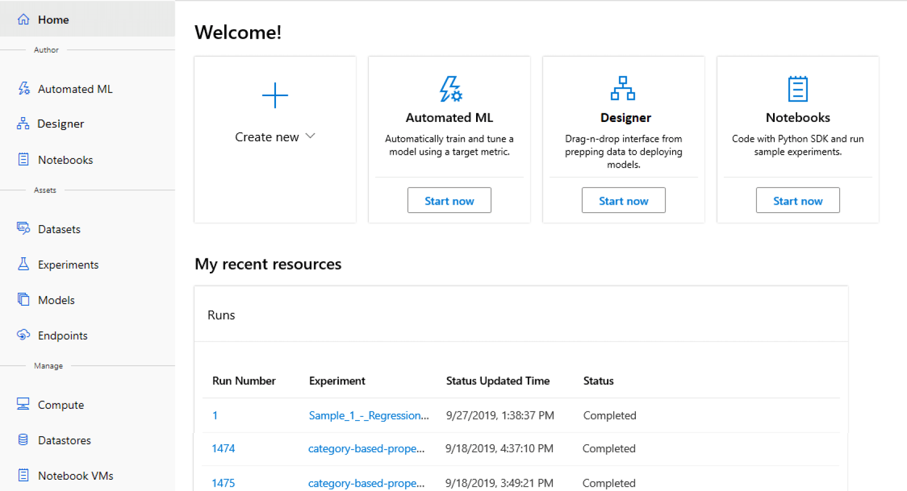
 

#### 비교: Azure Machine Learning(Designer 포함)과 Machine Learning Studio(클래식)

| 디자이너 | Studio(클래식) |
| :--- | :----| :--- |
| **제공 수준** | 디자이너=Preview, Azure Machine Learning=GA | GA(일반 공급) |
| **I/F: Drag & Drop** | yes | yes |
| **실험** | 컴퓨팅 대상으로 크기 조정 | 크기 조정(10GB 학습 데이터 제한) |
| **인터페이스용 모듈** | [인기 있는 많은 모듈](https://docs.microsoft.com/ko-kr/azure/machine-learning/algorithm-module-reference/module-reference) | 다수 |
| **Compute Target Training** | AML 컴퓨팅(GPU/CPU) | 전용 컴퓨팅 대상, CPU만 해당 |
| **Compute Target Inference** | 실시간 유추를 위한 Azure Kubernetes Service 일괄 처리 유추를 위한 AML 계산 | 전용 웹 서비스 형식, 사용자 지정 불가능 |
| **ML 파이프라인** | 파이프라인 제작 게시된 파이프라인 파이프라인 엔드포인트 [ML 파이프라인에 대해 자세히 알아보기](https://docs.microsoft.com/ko-kr/azure/machine-learning/concept-ml-pipelines) | 지원되지 않음 |
| **ML Ops** | 구성 가능한 배포, 모델 및 파이프라인 버전 관리 | 기본 모델 관리 및 배포 |
| **모델** | 학습 작업에 따라 다양한 표준 형식 | 독점적이며 이식 불가능 형식 |
| **자동화된 모델 교육** | 아직 ~~디자이너에서는 미지원~~ 인터페이스 및 SDK에서 지원 | 예 |

 

---
### Workspace(작업 영역)

* Azure ML의 최상위 Resource
* Azure ML에서 쓰이는 모든 Artifact 사용 가능한 중앙 집중식 환경
* 학습 실행 기록 유지(Logs, Metrics, Outputs, Snapshots of Scripts)최고 성능 모델 선택 가능
 

#### [Workspace 분류 체계]
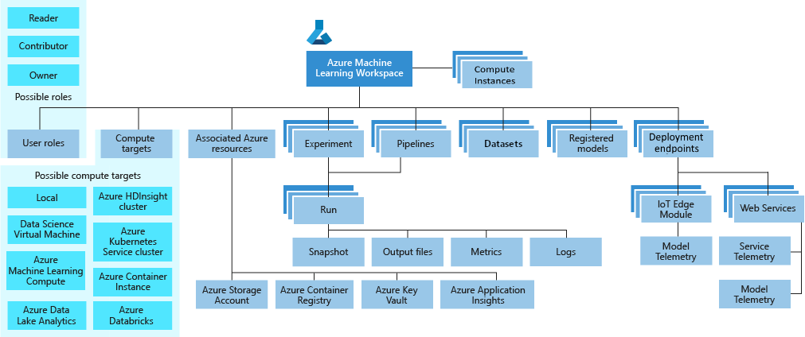

*필요 시 외부 **Azure Compute Instance** 포함 가능
* **User Roles**: Workspace 공유
* **Compute Target**: Experiments 실행
* **Associated Azure Resources**: Workspace 생성 시 연결된 Resource 함께 생성
* **Experiment**: 모델 작성에 사용하는 학습 실행
* **Pipelines**: 모델 학습/재학습에 사용하는 Workflow
* **Datasets**: 모델 학습, Pipelining에 사용하는 데이터 관리
* **Registered Models**: 모델 배포를 위해 등록한 모델
* **Deployment Endpoints**: Registered Models/Scoring Scripts 사용하여 생성
 

#### Workspace용 도구
* Web
  - **Azure ML Studio**
  - **Azure ML Designer(Enterprise Edition Only)**
* SDK
  - **Python SDK**
  - **R SDK**
* CLI
  - **Azure ML CLI**
 

#### [지원 기능]
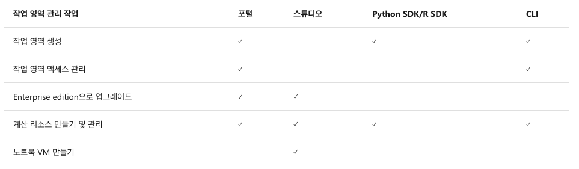

> ***NOTE:**
> 
> 컴퓨팅 인스턴스는 **미국 중북부** 또는  **영국 남부 지역** 이 있는 작업 영역에서만 사용할 수 있습니다.
> 작업 영역이 다른 지역에 있으면 **Notebook VM**을 계속 만들어 사용할 수 있습니다.
 

#### 연결 Resources
* **Azure Container Registry**: 학습/배포에 사용할 Docker Container 등록, 배포 이미지 만들 때 까지 지연 로드
* **Azure Storage Account**: 기본 데이터 저장소로 사용. Jupyter Notebook도 여기에 저장
* **Azure Appl. Insight**: 모델 모니터링 정보 저장
* **Azure Key Vault**: Compute Target 암호, 기타 중요 정보 저장
 

---
### Azure ML Environments
Script 개발, 학습, 배포에 활용하는 Versionining된 설정

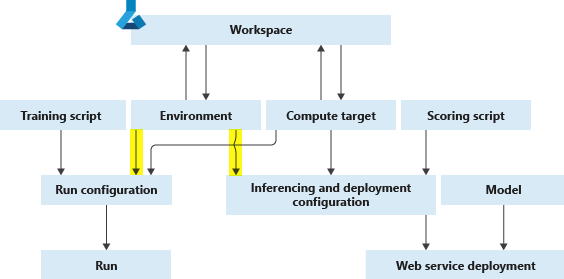

환경범주
* Curated Env.: Azure ML 기본제공. ML Framework 활용을 위한 기본 Python Packages & Setting 포함.
* User-managed Env.: 환경설정, 학습 Script에서 직접 관리-`pip dependency`: `azureml-defaults >= 1.0.45`(Web service Hosting에 필요)
* System-managed Env.: `conda` 기반 Python 환경 및 Script 종속성 관리

---
### ML Pipeline

#### [서비스 예시]
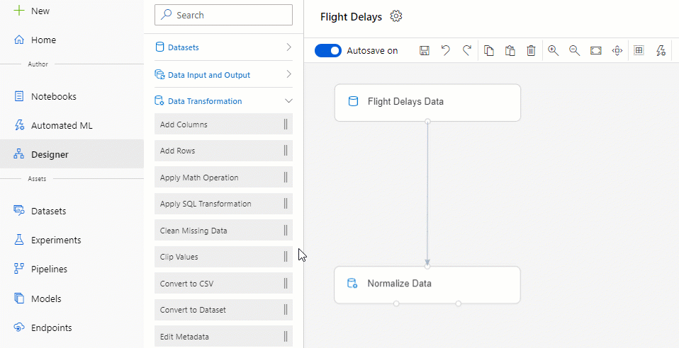

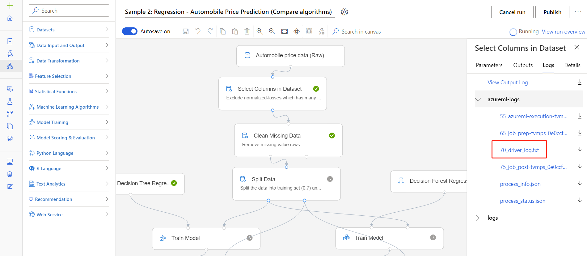

#### [다른 Pipeline 서비스와 비교]

| 파이프라인 | 수행작업 | 정식 파이프
| :------ | :-------- | :------|
| **Azure ML Pipelines**	| ML Scenario Template으로 재사용 가능한 ML Workflow 정의 | 데이터 -> 모델 |
| **Azure Data Factory** | 데이터 이동, 변환, 제어 작업을 그룹화 | 데이터 -> 데이터 |
| **Azure Pipelines**	| 모든 플랫폼/클라우드에 Appl.의 지속적 통합 및 전달	| 코드 -> 앱/서비스 |

#### [주요장점]

| 장점 | Description |
|:--- | :------|
| **무인 실행** | 무인 방식으로 **병렬/순차 실행 및 예약**으로 안정성 확보 |
| **다른 유형의 계산** | **개별 Pipeline**을 사용하여 다양한 Compute Resource, Storage 활용 가능  (**HDInsight**, **GPU 데이터 과학 Vm**, **Databricks** 등) |
| **재사용 가능** | **Pipeline Template**으로 시나리오 관리(재학습 ,Batch-scoring 등) REST 호출로 외부 시스템에 게시된 Pipeline 트리거 |
| **추적 및 버전 관리** | **Pipelines SDK**로 Data Source, Input, Output 이름과 버전 지정하여 관리 자동화  생산성 향상을 위해 스크립트/데이터로 구분하여 관리 가능 |
| **성과** | 작업항목 모듈화로 소프트웨어 품질 향상 |
| **협업** | ML Design 시 공동 작업 수행 편의성 증대 |
 

---

#### [Azure ML Model Workflow]
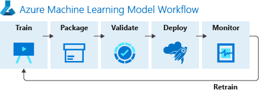

#### [Azure ML Experiment Workflow]
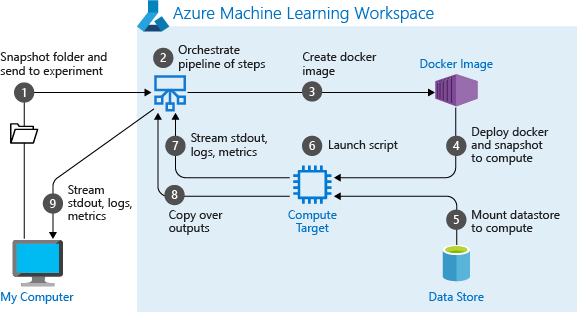

#### [Azure ML Architecture]

 

---
### Data

#### [Azure Dataset with `Datastore`]
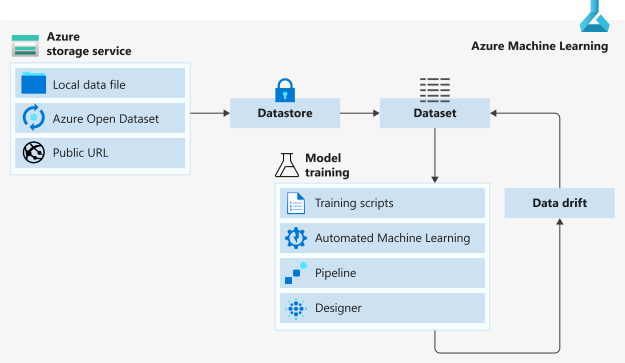

> ***NOTE:**
> 
> **Data Drift**: ML Context에서, 모델의 성능 저하를 초래하는, 입력 데이터의 변경 내용을 말함.
 

#### Datastore
Azure ML에서의 Data 연결점-Azure Storage Service의 추상화된 형태

등록 가능한 Azure storage 서비스:
* Azure Blob 컨테이너
* Azure 파일 공유
* Azure Data Lake
* Azure Data Lake Gen2
* Azure SQL Database
* Azure Database for PostgreSQL
* Databricks 파일 시스템
* Azure Database for MySQL

#### [Azure Dataset without `Datastore`]
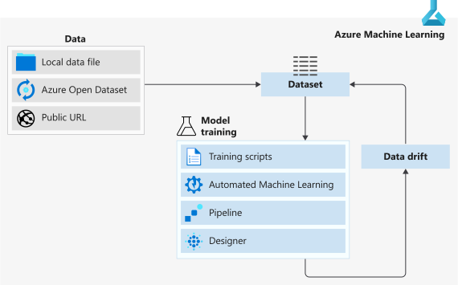

---
