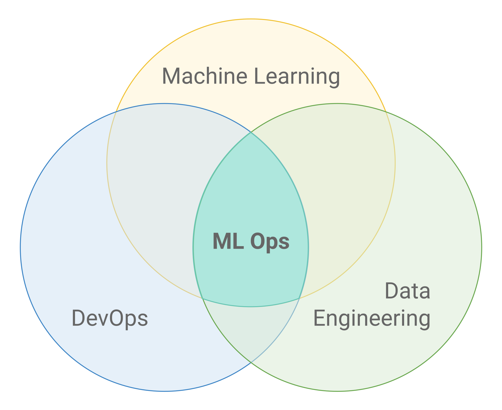
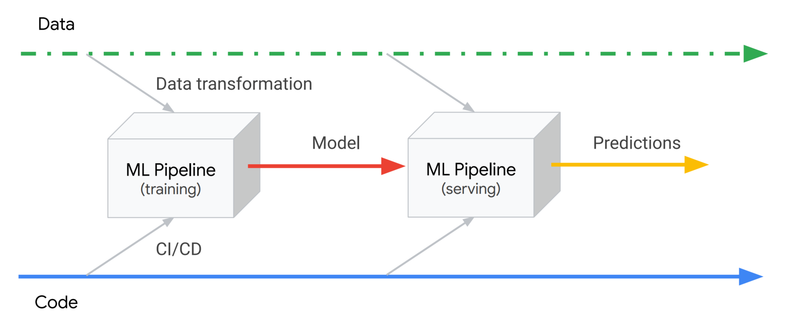

# MLOps: Overview

> * 연구개요
>   - MLOps의 정의
>   - As-is 대비 차별점
>   - 연구범위

## 연구개요
### MLOps의 정의

* Machine Learning 
* `"MLOps" = "DevOps" + "ML" = "Code" + "Data" + "Model"`

* 필수요소
  - Reproducibility(재현성)
    * 디버깅: 추적 가능한 오류
	* 균일한 결과 보장
	* 재사용성: 컴포넌트 모듈화, Library 추상화
	* Version Control
  - Orchestration(배치/정렬 자동화)
    * Production 단계의 Model Serving 복잡도를 다룸(CI/CD, Monitoring과 유사하지만 다른 개념)
	* Monotoring
	  - Short-term: Anomalies, Bias, Model Validation
	  - Long-term: Errors, Outages, Performance
	* Compliance
	  - 언제, 무엇이, 왜, 어떻게 발생했는지
	  - [Guidelines for and properties of compliant ML](https://www.youtube.com/watch?v=eOzl-LFqYFM&feature=youtu.be&t=366)
	  - Debugging, Error Reporting
	* Resource 할당
	  - 유연한 관리(Auto-scaling, Serverless)
	  - 지원 Software
	    * ETL Frameworks
		* HDFS-based Services
		* Kubernetes cluster
		* Distributed Frameworks

### ML Pipeline

As-is 대비 차별점: `DevOps` & `Legacy Data Engineering`

