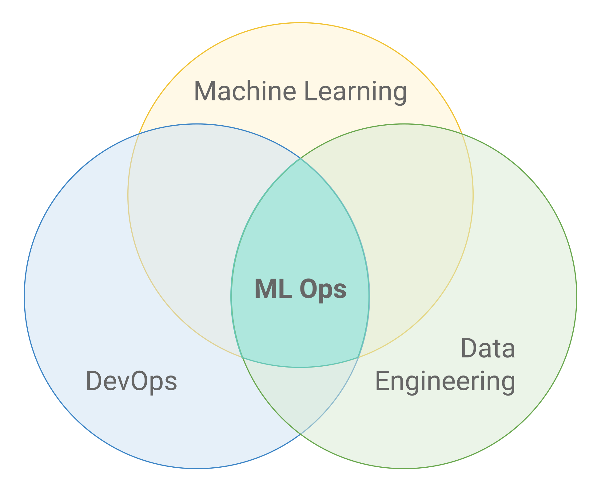
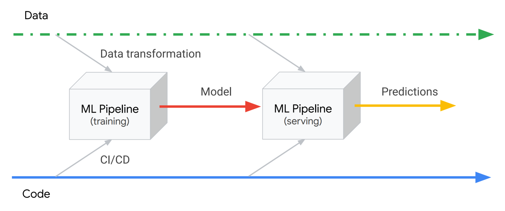
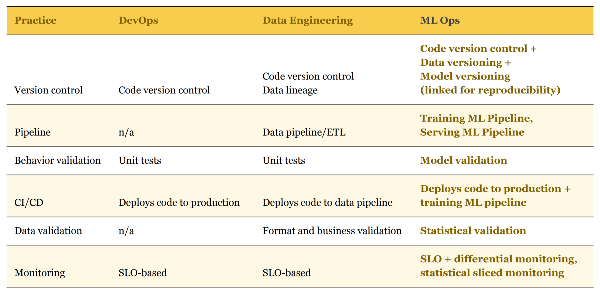

# MLOps: Overview

> * 연구개요
>   - MLOps의 정의
>   - As-is 대비 차별점
>   - 연구범위

---

### 연구개요
### MLOps 정의

* ML Workflow의 복잡도 증가로 인해 ML 서비스 품질을 유지하기 위해 탄생한 개념
* 지속적인 데이터 품질관리 & 모델 생명주기 관리로 무중단 서비스 가능
* `"MLOps" = "DevOps" + "ML" = "Code" + "Data" + "Model"`

### MLOps Pipeline
* MSA Workflow 기반 작업 모듈화/추상화를 통해 전체 서비스 Pipeline 관리

### MLOps 필수요소
- **Reproducibility(재현성)**
  * 디버깅: 추적 가능한 오류
  * 균일한 결과 보장
  * 재사용성: 컴포넌트 모듈화, Library 추상화
  * Version Control
 

- **Orchestration(배치/정렬 자동화)**
  * Production 단계의 Model Serving 복잡도를 다룸
    (CI/CD, Monitoring과 유사하지만 다른 개념)
  * **Monotoring**
    - Short-term: Anomalies, Bias, Model Validation
    - Long-term: Errors, Outages, Performance
  * **Compliance**
    - 언제, 무엇이, 왜, 어떻게 발생했는지
    - [Guidelines for and properties of compliant ML](https://ww.youtube.com/watch?v=eOzl-LFqYFM&feature=youtu.be&t=366)
    - Debugging, Error Reporting
  * **Resource 할당**
    - 유연한 관리(Auto-scaling, Serverless)
      * ETL Frameworks
  	  * HDFS-based Services
  	  * Kubernetes cluster
  	  * Distributed Frameworks

 

### As-is 대비 차별점: (`DevOps` & `Data Engineering`)

### 연구범위

* Vendor별 서비스 현황조사
  - 서비스 대상
    * AWS
      - SageMaker
    * Azure
      - Machine Learning
    * GCP
      - AI Platform
    * Databricks
      - Databricks
    * SK
      - AccuInsight+

* 서비스 비교(유사점 & 차별점)
* Vendor별 서비스 구성 예시
